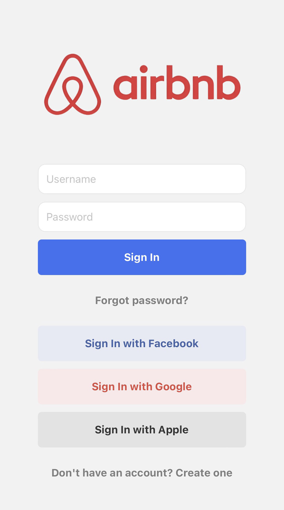
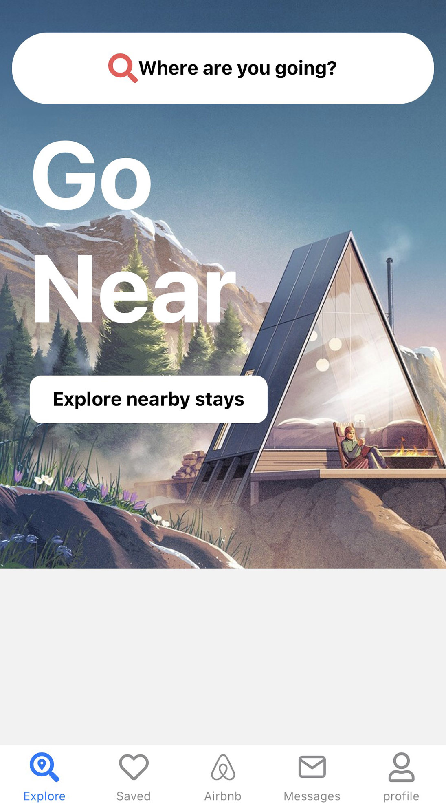

AirbnbClone-Expo
================

Description courte de votre application.

  
  
  

## Dépendances utilisées dans le projet

- **@aws-amplify/ui-react-native:** version 1.2.28
- **@react-native-async-storage/async-storage:** version 1.18.2
- **@react-native-community/netinfo:** version 9.3.10
- **@react-navigation/bottom-tabs:** version 6.5.11
- **@react-navigation/material-top-tabs:** version 6.6.5
- **@react-navigation/native:** version 6.1.9
- **@react-navigation/native-stack:** version 6.9.16
- **amazon-cognito-identity-js:** version 6.3.6
- **aws-amplify:** version 5.3.11
- **expo:** version 49.0.15
- **expo-splash-screen:** version 0.20.5
- **expo-status-bar:** version 1.6.0
- **expo-system-ui:** version 2.4.0
- **react:** version 18.2.0
- **react-hook-form:** version 7.47.0
- **react-native:** version 0.72.6
- **react-native-gesture-handler:** version 2.12.0
- **react-native-google-places-autocomplete:** version 2.5.6
- **react-native-maps:** version 1.7.1
- **react-native-safe-area-context:** version 4.6.3
- **react-native-screens:** version 3.22.0
- **react-native-vector-icons:** version 10.0.1
- **sharp-cli:** version 4.1.1
- **typescript:** version 5.2.2

## Technologies Utilisées

- React Native
- AWS Amplify
- TypeScript
- Expo

## Installation

Instructions d'installation de l'application et de ses dépendances.

## Utilisation

Instructions sur la façon d'utiliser l'application.

## Captures d'écran

Incluez ici d'autres captures d'écran de votre application.

## Licence

Indiquez la licence sous laquelle vous publiez votre application.
